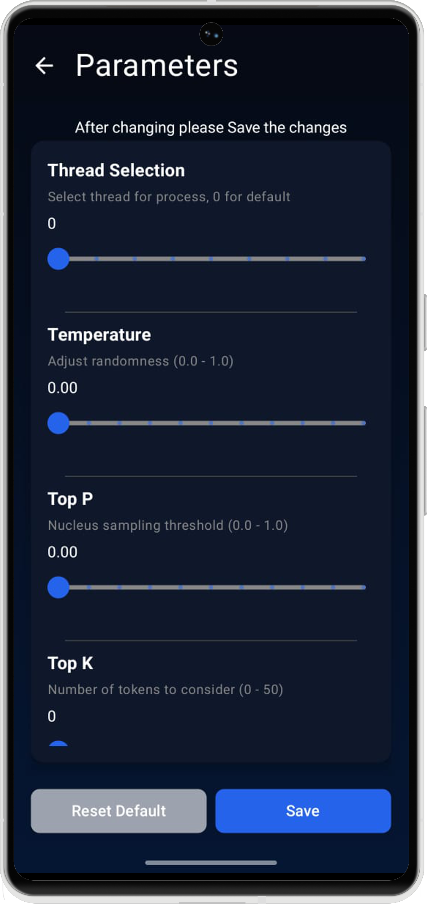

# Iris: Your Private, Offline-First AI Assistant for Android

[](https://play.google.com/store/apps/details?id=com.nervesparks.irisGPT&hl=en_IN)

Iris is a privacy-focused, offline-first large language model (LLM) application for Android. It allows you to run powerful AI models directly on your device, ensuring that your data remains private and secure. With Iris, you can have a personal AI assistant in your pocket, even without an internet connection.

For a detailed understanding of our project's goals, please see our [**Project Vision**](VISION.md).

## 🖼️ Screenshots

<div style="display: flex; gap: 15px; justify-content: center; flex-wrap: wrap;">
  <div style="text-align: center; width: 200px;">
    
    <p><strong>Main Screen</strong></p>
  </div>
  <div style="text-align: center; width: 200px;">
    
    <p><strong>Chat Screen</strong></p>
  </div>
  <div style="text-align: center; width: 200px;">
    
    <p><strong>Settings Screen</strong></p>
  </div>
  <div style="text-align: center; width: 200px;">
    
    <p><strong>Models Screen</strong></p>
  </div>
  <div style="text-align: center; width: 200px;">
    
    <p><strong>Parameters Screen</strong></p>
  </div>
</div>

For a detailed walkthrough of the app's user interface, please see our [**UI Flow Guide**](UI_FLOW.md).

## ✨ Features

*   **Works Offline**: Access all features without needing an internet connection.
*   **Privacy-Focused**: All data is processed securely on your device.
*   **Bring Your Own Models**: Download and use GGUF models from Hugging Face or other sources.
*   **Open Source**: Fully transparent development. We welcome contributions!
*   **Customizable Parameters**: Adjust `n_threads`, `top_k`, `top_p`, and `temperature` to fine-tune model performance.
*   **Text-to-Speech & Speech-to-Text**: Interact with your AI assistant using your voice.
*   **Default Model Selection**: Set a default model to load automatically on startup.

## 🚀 Getting Started

### Installation

The easiest way to get started with Iris is to install it from the Google Play Store:

[](https://play.google.com/store/apps/details?id=com.nervesparks.irisGPT&hl=en_IN)

You can also download the latest release from our [**Releases**](https://github.com/nerve-sparks/iris_android/releases) page.

### Building from Source

If you want to build the project from source, you will need Android Studio and the Android NDK.

1.  **Clone the repository:**
    ```bash
    git clone https://github.com/nerve-sparks/iris_android.git
    cd iris_android
    ```

2.  **Clone `llama.cpp`:**
    ```bash
    git clone https://github.com/ggerganov/llama.cpp.git
    cd llama.cpp
    git checkout 1f922254f0c984a8fb9fbaa0c390d7ffae49aedb
    cd ..
    ```

3.  **Open in Android Studio:**
    *   Open Android Studio and select "Open an Existing Project".
    *   Navigate to the `iris_android` directory and open it.
    *   Android Studio will automatically sync the Gradle project.

4.  **Build the app:**
    *   Connect your Android device or start an emulator.
    *   Click the "Run" button in Android Studio.

## 🤝 Contributing

We welcome contributions from the community! If you would like to contribute, please follow these steps:

1.  **Fork the repository.**
2.  **Create a new feature branch:**
    ```bash
    git checkout -b my-new-feature
    ```
3.  **Commit your changes:**
    ```bash
    git commit -m 'Add some feature'
    ```
4.  **Push your branch to the remote repository:**
    ```bash
    git push origin my-new-feature
    ```
5.  **Open a Pull Request.**

## Disclaimer

*   Iris may produce **inaccurate results** depending on the complexity of queries and model limitations.
*   Performance and accuracy are influenced by the size and type of model selected.

## 📞 Contact

This project is maintained by [**Nerve Sparks**](https://www.nervesparks.com). If you have any questions or feedback, please feel free to contact us.
